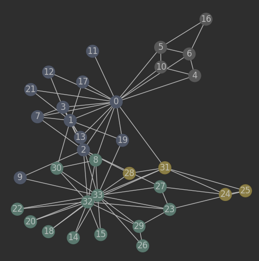
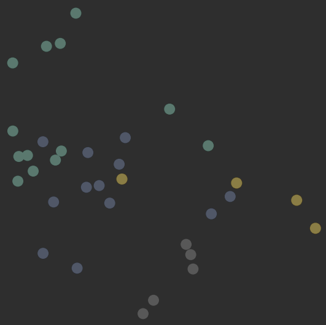
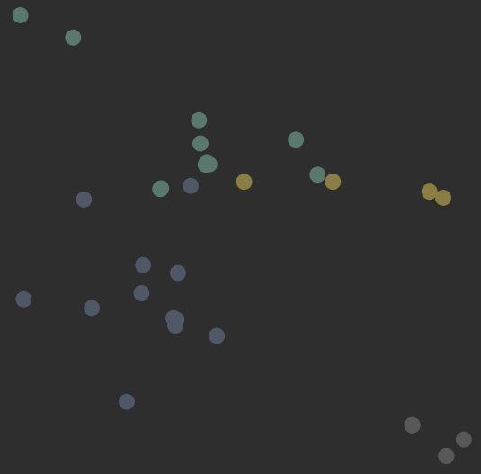
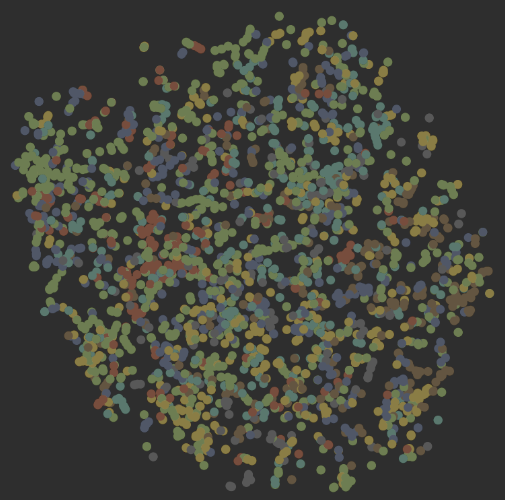
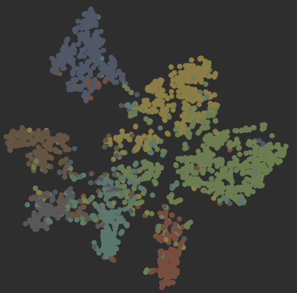

# 深度学习的学习实例仓库
## GNN图神经网络
### pyg_demo_0
关于pyg的安装以及相关基础操作，包含：
1. 根据torch、cuda版本安装torch_geometric：torch版本：2.4.1
cuda版本：11.8  pyg版本：2.6.1；
2. 图的基本操作、进阶操作。

### pyg_demo_1  
pyg的第一个示例演示  
数据集为：Zachary‘s karate club network  
数据集特征：  
````
Dataset: KarateClub()
================================  
Number of graphs: 1
Number of features: 34
Number of classes: 4
````
数据集graph：  
  
根据特征将数据集中的点进行将为，并将其可视化：  
  
训练模型为：半监督semi-supervised GCN  
四分类结果：  
  
训练的loss值为：0.0013
### pyg_demo_Core  
Cora数据集是论文引用数据集，每一个点有1433维向量，最终要对每个点进行7分类任务，每个类别只有20个点有标注。  
数据集特征：  
````
Dataset: Cora():
====================
Number of graphs: 1
Number of features: 1433
Number of classes: 7

Data: Data(x=[2708, 1433], edge_index=[2, 10556], y=[2708], train_mask=[2708], val_mask=[2708], test_mask=[2708])
=====================
Number of nodes: 2708
Number of edges: 10556
Average node degree:3.90
Number of training nodes:140
Training node label:0.05
Has isolated nodes:False
Has self-loops:False
Is undirected:True
````
2708篇论文，每个点是1433维向量；  
邻接矩阵为稀疏，2维，10556个边；
val_mask和test_mask分别表示这个点需要被用到哪个集。  
下图为将为2维后的数据图：  


在本文件中，设置了一组对比试验  
1. 首先，用传统的MPL神经网络进行训练。  
其结果如下：
```
Loss:0.3810
Test Accuracy: 0.5900
```
2. 接着根据MLP的网络设计出GCN网络。我们将两者进行对比：
```python
class MLP(torch.nn.Module):
    def __init__(self, input_dim, hidden_dim, output_dim):
        super().__init__()
        torch.manual_seed(12345)
        self.layer1 = Linear(input_dim, hidden_dim)
        self.layer2 = Linear(hidden_dim, output_dim)

    def forward(self, x):
        x = self.layer1(x)
        x = x.relu()
        x = F.dropout(x, p = 0.5, training=self.training)
        x = self.layer2(x)
        return x
```
```python
class GCN(torch.nn.Module):
    def __init__(self, input_dim, hidden_dim, output_dim):
        super().__init__()
        torch.manual_seed(1234567)
        self.conv1 = GCNConv(input_dim, hidden_dim)
        self.conv2 = GCNConv(hidden_dim, output_dim)

    def forward(self, x, edge_index):
        x = self.conv1(x, edge_index)
        x = x.relu()
        x = F.dropout(x, p=0.5, training=self.training)  # 加入dropout
        x = self.conv2(x, edge_index)
        return x
```  
3. 最后对GCN进行训练和分类。结果如下：  
```
Loss:0.2379
Test Accuracy: 0.8060
```  

###  pyg_demo_TU_MUTAG
